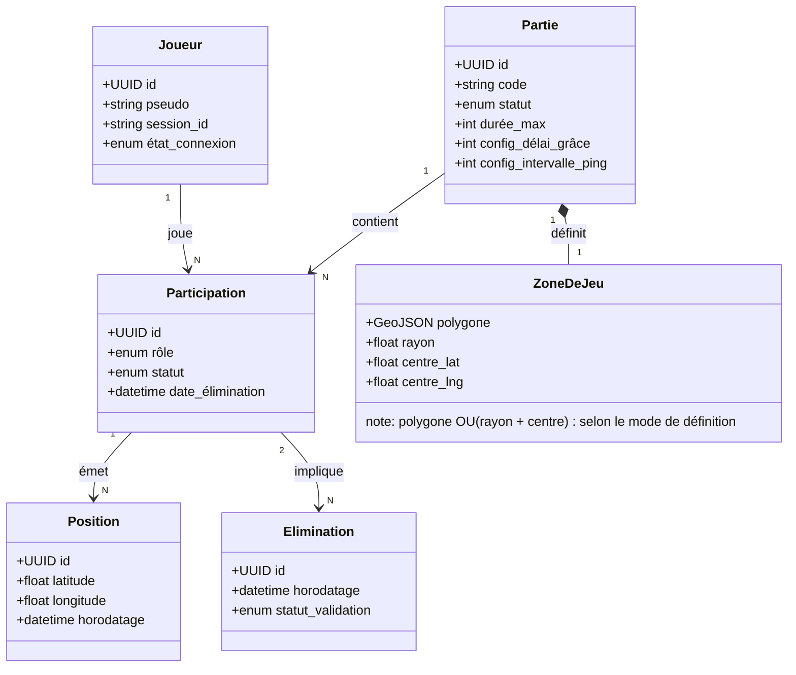

# Specification fonctionnelle ManHunt IRL

Sep 27, 2026 · @Anathos Elemental

Application web progressive (PWA) permettant à un groupe d'amis de jouer à ManHunt dans la vie réelle, avec géolocalisation en temps réel, rôles dynamiques et gestion de partie multijoueur, sans installation store.

## 1. Contexte et objectifs

### 1.1. Contexte

ManHunt IRL est une PWA (Progressive Web App) permettant à un groupe d'amis de rejouer le concept du jeu vidéo *Manhunt* (aussi appelé *The Hunt*) dans un espace physique réel. Un ou plusieurs joueurs incarnent des **Proies** qui tentent de rester libres dans une zone géographique définie ; les autres joueurs incarnent des **Chasseurs** qui cherchent à les localiser et les éliminer en les touchant physiquement.

Le besoin naît de l'absence d'outil simple, dédié et temps réel pour organiser ce type de partie informelle entre amis, sans avoir à recourir à des groupes WhatsApp, des appels téléphoniques ou du matériel externe.

## 2. Glossaire et modèle de données

### 2.1. Glossaire

| Terme | Définition |
| --- | --- |
| **Partie** | Session de jeu complète, de sa création à sa fin, identifiée par un code unique. |
| **Lobby** | Phase d'attente avant le début d'une Partie, pendant laquelle les Joueurs rejoignent et les paramètres sont configurés. |
| **Joueur** | Utilisateur participant à une Partie. Chaque Joueur possède un rôle actif (Chasseur ou Proie). |
| **Hôte** | Joueur ayant créé la Partie. Il est responsable des paramètres et du démarrage. |
| **Chasseur** *(Hunter)* | Rôle actif : cherche à localiser et à éliminer les Proies. Sa position est visible par les autres Chasseurs en temps réel continu. Il voit également la position des Proies à intervalle configurable (cf. RG-13). |
| **Proie** *(Prey)* | Rôle actif : cherche à rester libre jusqu'à la fin du temps imparti. Sa position est communiquée aux Chasseurs à intervalle configurable (cf. RG-13). |
| **Zone de jeu** | Périmètre géographique délimité (polygone ou rayon autour d'un point) dans lequel la Partie se déroule. |
| **Élimination** | Action par laquelle un Chasseur signale avoir touché physiquement une Proie, validant sa capture. |
| **Position** | Coordonnées GPS (latitude, longitude) d'un Joueur à un instant donné. |
| **Ping** | Signal périodique envoyé par l'application pour mettre à jour la Position d'un Joueur sur le serveur. |
| **Code de partie** | Identifiant court (ex. 6 caractères alphanumériques) permettant à un Joueur de rejoindre une Partie. |
| **Fin de partie** | État terminal déclenché automatiquement lorsque toutes les Proies sont éliminées ou que le chronomètre atteint zéro. |

### 2.2. Entités et attributs

| Entité | Attributs principaux |
| --- | --- |
| **Partie** | id, code (unique, court), statut (LOBBY / EN\_COURS / TERMINÉE), date\_création, date\_début, date\_fin, durée\_max (min), zone\_de\_jeu\_id (FK → ZoneDeJeu), config\_délai\_grâce (s), config\_intervalle\_ping (s) |
| **Joueur** | id, pseudo, session\_id (token opaque anonyme), état\_connexion (CONNECTÉ / DÉCONNECTÉ) |
| **Participation** | id, joueur\_id, partie\_id, rôle (CHASSEUR / PROIE), statut (LIBRE / ÉLIMINÉ), date\_élimination |
| **Position** | id, participation\_id, latitude, longitude, horodatage |
| **Élimination** | id, chasseur\_participation\_id, proie\_participation\_id, horodatage, statut\_validation (EN\_ATTENTE / CONFIRMÉE / CONTESTÉE) |

### 2.3. Relations

- Une **Partie** contient une ou plusieurs **Participations** (1 – N).
- Un **Joueur** peut avoir plusieurs **Participations** (une par Partie jouée) (1 – N).
- Une **Participation** est liée à plusieurs **Positions** (historique GPS) (1 – N).
- Une **Élimination** implique exactement deux **Participations** : un Chasseur et une Proie (N – 2).

### 2.4. Diagramme de classes



## 3. Règles de gestion

| ID | Intitulé | Description |
| --- | --- | --- |
| RG-01 | Unicité du code de partie | Le code de partie est généré aléatoirement et est unique parmi toutes les Parties en statut LOBBY ou EN\_COURS. |
| RG-02 | Nombre minimum de joueurs | Une Partie ne peut démarrer qu'avec au moins 2 Joueurs, dont au minimum 1 Chasseur et 1 Proie. |
| RG-03 | Nombre maximum de joueurs | Une Partie est limitée à 20 Joueurs simultanés. |
| RG-04 | Rôles mutuellement exclusifs | Un Joueur ne peut être à la fois Chasseur et Proie dans la même Partie. |
| RG-05 | Démarrage réservé à l'Hôte | Seul l'Hôte peut déclencher le démarrage de la Partie depuis le lobby. |
| RG-06 | Délai de grâce | Après le démarrage, le serveur bloque le routage des positions des Proies vers les Chasseurs pendant la durée du délai de grâce (configurable, défaut : 60 s), leur laissant le temps de se cacher. |
| RG-07 | Visibilité des Proies auprès des Chasseurs | La position GPS des Proies est transmise à tous les Chasseurs à intervalle configurable (RG-13). Elle n'est pas transmise aux autres Proies. |
| RG-08 | Visibilité des Chasseurs entre eux | La position GPS des Chasseurs est visible par tous les autres Chasseurs en temps réel continu (pas d'intervalle configuré). |
| RG-09 | Confirmation d'élimination | Une Élimination doit être confirmée par la Proie pour être effective. Sans réponse dans un délai de 60 s, l'Hôte arbitre. |
| RG-10 | Fin de partie automatique | La Partie se termine automatiquement si toutes les Proies sont ÉLIMINÉES ou si le chronomètre atteint 0. |
| RG-11 | Hors zone | Une Proie qui sort de la Zone de jeu reçoit une alerte. Si hors zone pendant plus de 15 s consécutives, elle est automatiquement éliminée et déclarée victorieuse. |
| RG-12 | Reconnexion | Un Joueur déconnecté pendant moins de 120 s peut se reconnecter à la Partie en cours sans pénalité. Au-delà, il est considéré DÉCONNECTÉ et ne participe plus activement. |
| RG-13 | Fréquence de ping GPS | La position des Proies est transmise au serveur à une fréquence configurable par l'Hôte avant le démarrage (valeur par défaut : 2 min, minimum : 3 s, maximum : 20 min). La position des Chasseurs est transmise en continu sans intervalle configurable. |
| RG-14 | Historique de positions | Les positions sont conservées en mémoire RAM pendant la durée de la Partie uniquement. Elles sont purgées 5 minutes après la fin de la Partie (pas de persistance disque). |
| RG-15 | Contenu des règles piloté par JSON | Le texte affiché dans la section « Règles du jeu » est lu depuis un fichier rules.json statique. Toute modification de ce fichier est reflétée sans redéploiement du code applicatif. |
| RG-16 | Attribution aléatoire des rôles | L'Hôte peut attribuer les rôles de manière aléatoire depuis le lobby. Le nombre de Proies est calculé automatiquement (⅓ des joueurs, min 1, max N−1). L'attribution est effectuée côté serveur (shuffle de Fisher-Yates) et diffusée à tous les joueurs simultanément. |
| RG-17 | Intervalle de ping dynamique | Lorsqu'une Proie est éliminée, l'intervalle de ping des Proies restantes diminue proportionnellement. Formule : `nouvel_intervalle = intervalle_initial × (proies_restantes / proies_initiales)`. Exemple : 3 Proies initiales, 1 éliminée → l'intervalle passe à 67 % de sa valeur initiale ; 2 éliminées → 33 %. Le plancher est le minimum configurable (3 s). |
| RG-18 | Historique des positions exportable | Les positions GPS de tous les joueurs sont conservées en mémoire pendant la durée de la partie. À la fin de la partie, l'historique complet est inclus dans le récapitulatif et peut être exporté par les joueurs (format JSON ou GPX). |
| RG-19 | Chat en jeu | Les joueurs disposent d'espaces de conversation textuels séparés par canal : Proies uniquement, Chasseurs uniquement, et Tous. Un joueur ne voit que les canaux correspondant à son rôle (une Proie ne voit pas le canal Chasseurs et inversement). |
| RG-20 | Objectifs de partie (mode grande partie) | L'Hôte peut activer un mode « objectifs » proposant une liste de missions secondaires aux Proies et/ou aux Chasseurs. La victoire peut être conditionnée à la complétion d'objectifs en plus de la survie / capture. |
| RG-21 | Validation manuelle par les Proies | En complément de la confirmation d'élimination (RG-09), les Proies peuvent signaler volontairement leur position ou valider manuellement un événement de jeu (ex. passage dans un point de contrôle). |

## 4. Exigences fonctionnelles

### 4.1. Catalogue synthétique

| ID | Intitulé | Priorité | Règles liées |
| --- | --- | --- | --- |
| EF-01 | Choisir un pseudo et obtenir une session anonyme | MUST | — |
| EF-02 | Créer une partie et obtenir un code | MUST | RG-01 |
| EF-03 | Rejoindre une partie via code | MUST | RG-01 |
| EF-04 | Configurer les paramètres de la partie (durée, zone, délai de grâce, intervalle de ping GPS) | MUST | RG-06, RG-13 |
| EF-05 | Assigner les rôles manuellement ou aléatoirement | MUST | RG-04, RG-16 |
| EF-06 | Démarrer la partie (Hôte uniquement) | MUST | RG-02, RG-05 |
| EF-07 | Envoyer et recevoir les positions GPS en temps réel | MUST | RG-07, RG-08, RG-13 |
| EF-08 | Afficher la carte avec les Chasseurs et les Proies | MUST | RG-07, RG-08 |
| EF-09 | Déclarer une élimination | MUST | RG-09 |
| EF-10 | Confirmer ou contester une élimination | MUST | RG-09 |
| EF-11 | Arbitrer une élimination contestée (Hôte) | SHOULD | RG-09 |
| EF-12 | Déclencher la fin de partie automatiquement | MUST | RG-10 |
| EF-13 | Afficher le résumé de partie | MUST | — |
| EF-14 | Alerter une Proie hors zone | SHOULD | RG-11 |
| EF-15 | Gérer la reconnexion | SHOULD | RG-12 |
| EF-16 | Dissoudre / quitter la partie (Hôte) | MUST | — |
| EF-17 | Afficher la section Règles depuis un fichier JSON | MUST | RG-15 |
| EF-18 | Ajuster dynamiquement l'intervalle de ping des Proies | SHOULD | RG-17 |
| EF-19 | Exporter l'historique des positions en fin de partie | SHOULD | RG-18 |
| EF-20 | Chat en jeu (canaux Proies / Chasseurs / Tous) | SHOULD | RG-19 |
| EF-21 | Mode objectifs pour les grandes parties | COULD | RG-20 |
| EF-22 | Validation manuelle d'événements par les Proies | COULD | RG-21 |

### 4.2. Fiche d'exigence détaillée

#### EF-07 — Envoyer et recevoir les positions GPS en temps réel

| Champ | Valeur |
| --- | --- |
| **Description** | Pendant une Partie EN\_COURS, les Proies émettent leur position GPS à intervalle configurable (RG-13) ; les Chasseurs émettent leur position en continu. Tous les Chasseurs voient la position des autres Chasseurs et celle des Proies. Les Proies ne reçoivent aucune position. |
| **Acteurs** | Joueur (émission), Chasseur (réception), Système (routage) |
| **Priorité** | MUST |
| **Règles** | RG-07, RG-08, RG-13 |
| **Critère d'acceptance** | Position des autres Chasseurs vieille de moins de 3 s dans 95 % des cas. Position des Proies vieille d'au plus l'intervalle configuré + 3 s de délai réseau. |
| **Dépendances** | EF-06 (partie démarrée), EF-08 (affichage carte) |

#### EF-09 — Déclarer une élimination

| Champ | Valeur |
| --- | --- |
| **Description** | Un Chasseur peut signaler qu'il a touché physiquement une Proie en la désignant dans l'application. |
| **Acteurs** | Chasseur |
| **Priorité** | MUST |
| **Règles** | RG-09 |
| **Critère d'acceptance** | La Proie reçoit la notification de confirmation dans un délai ≤ 3 s après la déclaration. |
| **Dépendances** | EF-07 |

#### EF-17 — Afficher la section Règles depuis un fichier JSON

| Champ | Valeur |
| --- | --- |
| **Description** | L'application dispose d'une section « Règles du jeu » dont le contenu est chargé dynamiquement depuis un fichier `rules.json` hébergé avec l'application. Cela permet de mettre à jour les règles sans redéployer le code. |
| **Acteurs** | Joueur, Hôte |
| **Priorité** | MUST |
| **Règles** | RG-15 |
| **Structure JSON attendue** | Tableau de sections : `[{ "title": string, "content": string }]`. Chaque section est affichée avec son titre et son contenu formaté. |
| **Critère d'acceptance** | Le contenu de `rules.json` est affiché tel quel sans rechargement de la page. Une modification du fichier JSON est visible au prochain chargement de la section. |
| **Dépendances** | Accessible à tout moment : avant la partie, depuis le lobby, et pendant une partie EN\_COURS. |

#### EF-05 — Assigner les rôles manuellement ou aléatoirement

| Champ | Valeur |
| --- | --- |
| **Description** | L'Hôte peut assigner individuellement le rôle de chaque joueur (Chasseur ↔ Proie) via un bouton de basculement. Il peut également déclencher une attribution aléatoire : le serveur mélange les joueurs et assigne ~⅓ d'entre eux comme Proies (minimum 1, maximum N−1). L'attribution est animée côté client (les badges de rôle s'inversent visuellement) pour que tous les joueurs voient le changement simultanément. |
| **Acteurs** | Hôte |
| **Priorité** | MUST |
| **Règles** | RG-04, RG-16 |
| **Critère d'acceptance** | Après un clic sur « Aléatoire », chaque joueur voit son rôle mis à jour en ≤ 1 s. L'attribution garantit au moins 1 Chasseur et 1 Proie. |
| **Dépendances** | EF-02 (partie créée), lobby actif |

#### EF-18 — Ajuster dynamiquement l'intervalle de ping des Proies

| Champ | Valeur |
| --- | --- |
| **Description** | Lorsqu'une Proie est éliminée, le serveur recalcule l'intervalle de ping pour les Proies restantes : `nouvel_intervalle = intervalle_initial × (proies_restantes / proies_initiales)`. Le nouvel intervalle est appliqué immédiatement et diffusé à tous les joueurs. Le plancher est le minimum configurable (3 s). |
| **Acteurs** | Système (automatique) |
| **Priorité** | SHOULD |
| **Règles** | RG-17 |
| **Critère d'acceptance** | Après élimination d'une Proie sur 3, l'intervalle de ping diminue à ~67 % de sa valeur initiale dans un délai ≤ 3 s. |
| **Dépendances** | EF-09 (élimination), EF-07 (positions GPS) |

#### EF-19 — Exporter l'historique des positions en fin de partie

| Champ | Valeur |
| --- | --- |
| **Description** | Pendant la partie, le serveur conserve l'historique complet des positions de chaque joueur. À la fin de la partie, cet historique est inclus dans le récapitulatif (EF-13) et chaque joueur peut l'exporter au format JSON. L'historique est purgé avec le reste des données de la partie (5 min après la fin). |
| **Acteurs** | Joueur |
| **Priorité** | SHOULD |
| **Règles** | RG-18 |
| **Critère d'acceptance** | Le bouton d'export génère un fichier JSON contenant les trajets de tous les joueurs avec horodatage. |
| **Dépendances** | EF-13 (résumé de partie) |

#### EF-20 — Chat en jeu (canaux Proies / Chasseurs / Tous)

| Champ | Valeur |
| --- | --- |
| **Description** | Pendant une partie EN_COURS, les joueurs disposent d'un système de messagerie textuelle en temps réel organisé en canaux : **Proies** (visible uniquement par les Proies), **Chasseurs** (visible uniquement par les Chasseurs), **Tous** (visible par tous les joueurs). Le routage des messages est contrôlé côté serveur pour garantir l'isolation des canaux. |
| **Acteurs** | Joueur |
| **Priorité** | SHOULD |
| **Règles** | RG-19 |
| **Critère d'acceptance** | Un message envoyé sur le canal « Proies » n'est reçu par aucun Chasseur. Un message envoyé sur « Tous » est reçu par tous les joueurs connectés. Latence ≤ 3 s. |
| **Dépendances** | EF-06 (partie démarrée) |

#### EF-21 — Mode objectifs pour les grandes parties

| Champ | Valeur |
| --- | --- |
| **Description** | L'Hôte peut activer un mode « objectifs » dans la configuration de la partie. Ce mode propose une liste de missions (définie par l'Hôte ou prédéfinie) que les Proies et/ou les Chasseurs doivent accomplir. La victoire peut être conditionnée à la complétion d'objectifs en plus des conditions standard (survie / élimination totale). |
| **Acteurs** | Hôte (configuration), Joueur (complétion) |
| **Priorité** | COULD |
| **Règles** | RG-20 |
| **Critère d'acceptance** | L'Hôte peut créer au moins 3 objectifs personnalisés. Les joueurs voient leur progression en temps réel. |
| **Dépendances** | EF-04 (configuration partie) |

#### EF-22 — Validation manuelle d'événements par les Proies

| Champ | Valeur |
| --- | --- |
| **Description** | Les Proies peuvent signaler manuellement des événements de jeu : validation d'un passage à un point de contrôle, signalement volontaire de position, ou confirmation d'un objectif. Ces événements sont horodatés et enregistrés dans l'historique de la partie. |
| **Acteurs** | Proie |
| **Priorité** | COULD |
| **Règles** | RG-21 |
| **Critère d'acceptance** | Une Proie peut valider un événement en ≤ 2 actions. L'événement est visible dans le récapitulatif de fin de partie. |
| **Dépendances** | EF-21 (objectifs, si activé) |

## 5. Exigences non fonctionnelles

### 5.1. Catalogue des exigences non fonctionnelles

| ID | Caractéristique | Intitulé | Critère mesurable |
| --- | --- | --- | --- |
| ENF-01 | Performance | Latence de géolocalisation | Position des Chasseurs mise à jour en continu (délai réseau ≤ 3 s, 95 % des cas). Position des Proies rafraîchie selon l'intervalle configuré (défaut 2 min, max 20 min). |
| ENF-02 | Performance | Temps de démarrage de la partie | De l'appui sur « Démarrer » à la première position collectée : ≤ 3 s. |
| ENF-03 | Performance | Démarrage de l'application | Premier chargement (cold load) ≤ 3 s sur réseau 4G ; chargement depuis cache Service Worker ≤ 1 s. |
| ENF-04 | Fiabilité | Disponibilité du serveur | Uptime ≥ 99 % (hors maintenance planifiée). |
| ENF-05 | Fiabilité | Reconnexion transparente | Un Joueur déconnecté < 120 s retrouve son état de jeu sans action manuelle. |
| ENF-06 | Sécurité | Confidentialité des positions | La position des Proies est transmise aux Chasseurs uniquement à l'intervalle configuré. Les Proies ne reçoivent jamais la position des Chasseurs ni des autres Proies (contrôle serveur). |
| ENF-07 | Sécurité | Identification anonyme | Aucune authentification formelle. Le Joueur choisit un pseudo à l'entrée ; une session anonyme est créée côté serveur (ex. ID de session HTTP ou token opaque non signé) pour identifier les échanges d'une même partie. |
| ENF-08 | Facilité d'utilisation | Création + rejoindre une partie | Flux complet en ≤ 2 minutes pour un nouvel utilisateur sans aide. |
| ENF-09 | Compatibilité | Plateformes cibles | Navigateurs cibles : Chrome Android (toutes versions récentes) et Safari iOS ≥ 16.4. Accessible via URL, installable en PWA sans store. |
| ENF-10 | Compatibilité | Réseau | Fonctionnement nominal sur réseau 4G (débit ≥ 1 Mbps symétrique). |
| ENF-11 | Maintenabilité | Couverture de tests | Couverture unitaire ≥ 70 % des modules serveur critiques (géolocalisation, élimination). |
| ENF-12 | Portabilité | Déploiement | La PWA est accessible via une URL publique hébergée sur un serveur web (VPS, CDN). Aucune soumission store n'est requise ni prévue. |

## 6. Implémentation technique

### 6.1. Stack technique

| Couche | Technologie | Justification |
| --- | --- | --- |
| Frontend | SvelteKit (PWA) | Bundle léger, réactivité native adaptée au temps réel, cold load rapide sur mobile |
| Backend | Fastify (Node.js / TypeScript) | Performant, WebSocket natif via `@fastify/websocket`, stack déjà maîtrisée |
| Temps réel | WebSockets (ws) | Bidirectionnel obligatoire : les Chasseurs émettent et reçoivent en continu |
| Persistance | Aucune BDD :  état en mémoire (RAM) | Données éphémères (durée max d'une partie) ; zéro dépendance externe |
| Session | `localStorage` côté client | Stockage du `session_id` anonyme pour la reconnexion (RG-12) |
| Reverse proxy | Nginx | Reverse proxy HTTP + WebSocket, cohérent avec les autres services du VPS |
| Infra | VPS Linux, un seul process Node.js | Charge maximale : 20 joueurs simultanés, aucun besoin de scaling horizontal |
| Versioning | Git + GitHub | Hébergement du repo, CI via GitHub Actions, gestion des branches et PR |

### 6.2. Architecture

```
[Client SvelteKit PWA]
        │
        │ HTTPS / WSS
        ▼
[Nginx — reverse proxy]
        │
        │ HTTP / WS (localhost)
        ▼
[Fastify — process Node.js]
        │
        ├── Routes HTTP  (création de partie, rejoindre, règles JSON)
        └── WebSocket    (positions en temps réel, éliminations, événements)
                │
                └── État en mémoire (Map)
                      └── parties : Map<code, Partie>
                           └── joueurs : Map<session_id, Joueur>
                                └── position? : Position (champ inline)
```

### 6.3. Structure de l'état en mémoire

L'intégralité de l'état de jeu est maintenu dans des `Map` JavaScript côté serveur, sans persistance disque.

```typescript
type Rôle = 'CHASSEUR' | 'PROIE';
type Statut = 'LOBBY' | 'EN_COURS' | 'TERMINÉE';
type StatutJoueur = 'LIBRE' | 'ÉLIMINÉ' | 'DÉCONNECTÉ';

interface Position {
  latitude: number;
  longitude: number;
  horodatage: number;
}

interface Joueur {
  sessionId: string;
  pseudo: string;
  rôle: Rôle;
  statut: StatutJoueur;
  position?: Position;
  ws: WebSocket;
}

interface Partie {
  code: string;
  statut: Statut;
  hôteSessionId: string;
  joueurs: Map<string, Joueur>;
  débutAt?: number;
  duréeMax: number;        // en secondes
  délaiGrâce: number;      // en secondes
  intervalleProies: number; // en secondes
  zone: {
    type: 'cercle' | 'polygone';
    centre?: { latitude: number; longitude: number };
    rayon?: number;
    polygone?: { latitude: number; longitude: number }[];
  };
}

// Store global
const parties = new Map<string, Partie>();
```

Lorsqu'une partie passe en statut `TERMINÉE`, son entrée est supprimée de la `Map` après un délai de 5 minutes (le temps que les joueurs consultent le résumé).

### 6.4. Gestion des WebSockets

Chaque connexion WebSocket est associée à un `session_id`. Le serveur maintient une référence directe à l'objet `ws` dans l'entrée `Joueur`, ce qui permet de diffuser un message à un sous-ensemble de joueurs sans itérer sur toutes les connexions.

```typescript
// Diffusion aux Chasseurs (positions des Proies + autres Chasseurs)
function broadcastToChasseurs(partie: Partie, message: object) {
  for (const joueur of partie.joueurs.values()) {
    if (joueur.rôle === 'CHASSEUR' && joueur.ws.readyState === WebSocket.OPEN) {
      joueur.ws.send(JSON.stringify(message));
    }
  }
}

// Diffusion à tous (événements globaux : élimination, fin de partie)
function broadcastAll(partie: Partie, message: object) {
  for (const joueur of partie.joueurs.values()) {
    if (joueur.ws.readyState === WebSocket.OPEN) {
      joueur.ws.send(JSON.stringify(message));
    }
  }
}
```

### 6.5. Déploiement

```nginx
# /etc/nginx/sites-available/manhunt
server {
    listen 443 ssl;
    server_name manhunt.example.com;

    location / {
        proxy_pass http://localhost:3000;
        proxy_http_version 1.1;

        # Upgrade nécessaire pour les WebSockets
        proxy_set_header Upgrade $http_upgrade;
        proxy_set_header Connection "upgrade";
        proxy_set_header Host $host;
    }
}
```

Le frontend SvelteKit est servi en statique (dossier `build/`) directement par Nginx, ou via le process Fastify selon la configuration choisie. Le process Node.js est maintenu en vie par PM2.

### 6.6. Git workflow

Le projet suit un workflow **GitHub Flow** simplifié, adapté à un projet solo ou petite équipe.

**Branches**

| Branche | Rôle |
| --- | --- |
| `main` | Code stable, déployé en production |
| `dev` | Intégration des features en cours |
| `feat/<slug>` | Une feature ou un correctif isolé |

**Règles**

- Aucun commit direct sur `main`.
- Toute feature part d'une branche `feat/<slug>` créée depuis `dev`.
- La branche est mergée dans `dev` via Pull Request après relecture.
- `dev` est mergée dans `main` uniquement quand elle est stable et testée.
- Les messages de commit suivent [Conventional Commits](https://www.conventionalcommits.org/) : `feat:`, `fix:`, `chore:`, `docs:`, `refactor:`, `test:`.

**GitHub Actions**

```yaml
# .github/workflows/ci.yml
on:
  push:
    branches: [dev]
  pull_request:
    branches: [dev, main]

jobs:
  ci:
    runs-on: ubuntu-latest
    steps:
      - uses: actions/checkout@v4
      - uses: actions/setup-node@v4
        with:
          node-version: 20
      - run: npm ci
      - run: npm run lint
      - run: npm run typecheck
      - run: npm run test
```

**Déploiement**

Le déploiement en production est déclenché manuellement (ou via un tag `v*`) depuis `main` — pas de CD automatique sur push pour garder le contrôle.

## 7. Contenu du règlement (rules.json)

Cette section définit le contenu initial du fichier `rules.json` intégré à l'application (cf. EF-17, RG-15). Il est amené à évoluer indépendamment du code.

```json
[
  {
    "title": "Locomotion",
    "content": "Les Chasseurs sont libres d'utiliser tout moyen de locomotion à leur disposition (à pied, vélo, trottinette, voiture, etc.). Les Proies se déplacent uniquement à pied."
  },
  {
    "title": "Distance au sol",
    "content": "Les Proies doivent rester à moins de 5 mètres du sol à tout moment. Les Chasseurs ne sont soumis à aucune restriction de hauteur."
  },
  {
    "title": "Zone de jeu",
    "content": "Les joueurs doivent rester dans la zone définie avant le début de la partie. Toute Proie sortant de la zone est automatiquement éliminée."
  },
  {
    "title": "Visibilité en milieu non éclairé",
    "content": "Dans un environnement sans éclairage ambiant (nuit, zone sombre), les Proies sont tenues de porter une source de lumière visible (lampe frontale, lampe de poche ou équivalent)."
  },
  {
    "title": "Élimination",
    "content": "Un Chasseur élimine une Proie en la touchant physiquement. Il doit ensuite déclarer l'élimination dans l'application. La Proie dispose d'un délai pour confirmer ou contester."
  },
  {
    "title": "Fin de partie",
    "content": "La partie prend fin lorsque toutes les Proies sont éliminées, ou lorsque le chronomètre atteint zéro. Dans ce dernier cas, les Proies encore en jeu sont déclarées victorieuses."
  }
]
```

> **Note :** Ce fichier est à placer à la racine du serveur web. Toute modification est effective au prochain chargement de la section Règles, sans redéploiement applicatif.

## 8. Identité visuelle

### 8.1. Icône de l'application

L'icône de l'application représente une cible / viseur (crosshair) stylisée :

- Fond sombre (`#0f0f0f`) avec coins arrondis
- Trois anneaux concentriques rouge (`#ff4444`) avec opacité croissante vers le centre
- Réticule (lignes croisées) en rouge
- Point central rouge

**Fichiers fournis :**

| Fichier | Usage |
| --- | --- |
| `icon.svg` | Source vectorielle, favicon SVG |
| `icon-192.png` | PWA manifest (taille 192×192) |
| `icon-512.png` | PWA manifest (taille 512×512) |
| `icon-wide.svg` | Logo horizontal avec texte « ManHunt » — pour les écrans de chargement, partage social, en-têtes paysage |

### 8.2. Charte couleurs

| Rôle | Couleur | Hex |
| --- | --- | --- |
| Accent / Chasseur | Rouge | `#ff4444` |
| Proie | Bleu | `#44aaff` |
| Succès | Vert | `#44cc44` |
| Avertissement | Jaune | `#ffaa00` |
| Fond principal | Noir profond | `#0f0f0f` |
| Surface (cartes) | Gris sombre | `#1a1a1a` |
| Texte principal | Blanc cassé | `#e8e8e8` |
| Texte secondaire | Gris | `#888888` |
